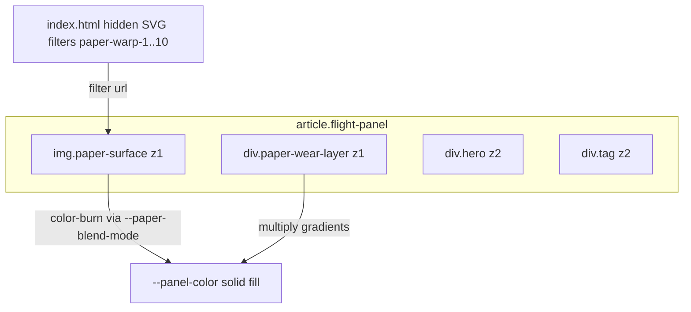

# Paper texture — ship to production poster

**Status:** SHIPPED (2026-08-05)

## Entry

Start here: this plan. Then load the set below.

**Cold-start first step:** copy this approved plan into [`docs/plans/airplane-frame/paper-texture-ship.plan.md`](docs/plans/airplane-frame/paper-texture-ship.plan.md) **before any code changes**. The live Cursor plan store copy is not the project artifact.

## Required reading

- [paper-texture-probe.plan.md](docs/plans/airplane-frame/paper-texture-probe.plan.md) — probe decisions + what was explicitly out of scope until now
- [paper-luggage-tag-texture.html](docs/design-mocks/paper-luggage-tag-texture.html) — **authoritative visual/CSS reference** for paper layers (do not edit the mock during ship)
- [visual-direction.md](docs/plans/airplane-frame/visual-direction.md) — existing panel ground/ink/tag locks to **preserve**; add one new lock row for paper texture
- [poster.css](css/poster.css) + [app.js](js/app.js) (`createFlightPanel`, `renderPosterWall`) + [index.html](index.html) — ship targets
- [process.md](docs/plans/airplane-frame/process.md) — read before commit
- [lessons.md](docs/plans/airplane-frame/lessons.md) — mock ≠ ship DOM; SVG filter on `img` not `background-image`

**Do not load:** full design-reference image set, spike tree, or `poster-ad-wall.html` unless diagnosing a carrier-color mismatch.

## Prerequisites

- Branch: `main` or feature branch off `main`
- Env: `worker/.dev.vars` with `APP_SHARED_SECRET` for local poster UAT ([local-dev.md](docs/runbooks/local-dev.md))
- Tools: Node (`node --test`), browser DevTools
- User gates: visual lock pass in `visual-direction.md` is **part of this ship** (probe was explore-only until now)
- Commit: only when the user explicitly asks (own-project mode still requires that ask)

## Locked decisions (this ship)

| Topic          | Lock                                                                                                                                                                                                                                                                                              |
| -------------- | ------------------------------------------------------------------------------------------------------------------------------------------------------------------------------------------------------------------------------------------------------------------------------------------------- |
| Scope          | `article.flight-panel` only — **not** `status-panel`                                                                                                                                                                                                                                              |
| Technique      | Hybrid: photographic base + per-slot SVG `feDisplacementMap` warp (same as mock)                                                                                                                                                                                                                  |
| Asset          | [`assets/textures/paper-texture-size-medium.jpg`](assets/textures/paper-texture-size-medium.jpg) — present on disk, currently untracked; add + stage with attribution                                                                                                                             |
| Blend          | Production defaults: `--paper-opacity: 0.65` and `--paper-blend-mode: color-burn` on `:root`. `.paper-surface` **must** use `opacity: var(--paper-opacity)` and `mix-blend-mode: var(--paper-blend-mode)`. Do not copy the mock’s hardcoded `0.65` / `color-burn` literals onto `.paper-surface`. |
| Dial knobs     | `:root` only: `--paper-opacity`, `--paper-blend-mode`, `--paper-wrinkle`, `--paper-wear` — no product UI sliders                                                                                                                                                                                  |
| Uniqueness     | 10 fixed slots (`data-paper-slot` + `data-warp` 1–10); assign `((index % 10) + 1)` at render via `assignPaperSlot`                                                                                                                                                                                |
| DOM            | `` + `<div class="paper-wear-layer">` as **first children** of each flight panel; **no** `.panel-content` wrapper                                                                                                                                                      |
| CSS file       | New [`css/poster-paper.css`](css/poster-paper.css) only. Link it from [`index.html`](index.html) **after** `css/poster.css`. Do **not** append paper rules into `poster.css`.                                                                                                                     |
| Stacking       | `isolation: isolate` on `.flight-panel`; paper layers `z-index: 1`; `.hero` + `.tag` `position: relative; z-index: 2`                                                                                                                                                                             |
| Reduced motion | Under `prefers-reduced-motion: reduce`, drop SVG warp filter (keep static photo + wear gradients). Put this media query in `poster-paper.css`.                                                                                                                                                    |
| Silhouette tag | Frame 2 soft tag silhouette — **not pursued** (probe retired)                                                                                                                                                                                                                                     |

## Architecture



**Source of truth for slot transforms:** CSS rules in [`css/poster-paper.css`](css/poster-paper.css). **Source of truth for slot index:** `assignPaperSlot` in [`js/lib.js`](js/lib.js).

## Implementation chunks

### 0 — Persist plan artifact

- Copy the approved plan body into [`docs/plans/airplane-frame/paper-texture-ship.plan.md`](docs/plans/airplane-frame/paper-texture-ship.plan.md).
- Do **not** start chunks 1–8 until that project path exists.
- **Verify:** `test -f docs/plans/airplane-frame/paper-texture-ship.plan.md`; [`paper-texture-probe.plan.md`](docs/plans/airplane-frame/paper-texture-probe.plan.md) still marked explore-only.

### 1 — Production asset + attribution

- Add (do not commit unless asked) [`assets/textures/paper-texture-size-medium.jpg`](assets/textures/paper-texture-size-medium.jpg) if still untracked.
- Add [`assets/textures/ATTRIBUTION.md`](assets/textures/ATTRIBUTION.md) documenting source/license (mirror probe attribution; cite original source if known beyond project asset).
- **Verify:** `ls assets/textures/` shows jpg + ATTRIBUTION; during local Pages preview, `http://127.0.0.1:8080/assets/textures/paper-texture-size-medium.jpg` is not 404.

### 2 — SVG warp definitions

- Add hidden SVG block to [`index.html`](index.html) (before `</body>`, after views — same pattern as mock lines 451–486):
  - Class `svg-defs` (position absolute, 0×0, overflow hidden)
  - 10 `<filter id="paper-warp-N">` defs — copy seeds/scales from mock slots 1–8; **add slots 9–10** with new `feTurbulence` seeds (e.g. 142, 163) and scales (11–15 range).
- Put the `.svg-defs` rule in [`css/poster-paper.css`](css/poster-paper.css), not `poster.css`.
- **Verify:** DevTools → Elements → 10 filters present; no duplicate IDs. Static test in chunk 8 also asserts `paper-warp-1`…`paper-warp-10` exist in `index.html`.

### 3 — Poster CSS (paper layers)

Port mock rules ([`paper-luggage-tag-texture.html`](docs/design-mocks/paper-luggage-tag-texture.html) ~lines 153–308) into **only** [`css/poster-paper.css`](css/poster-paper.css).

Link from [`index.html`](index.html) **after** `css/poster.css`:

```html
<link rel="stylesheet" href="css/poster.css" />
<link rel="stylesheet" href="css/poster-paper.css" />
```

**`:root` additions** (defaults match mock appearance):

```css
--paper-opacity: 0.65;
--paper-blend-mode: color-burn;
--paper-wrinkle: 0.45;
--paper-wear: 0.42;
```

**`.flight-panel`:** add `isolation: isolate`.

**`.paper-surface`:** port positioning, `object-fit: cover`, transform stack using per-slot custom properties (`--panel-paper-pos`, scale/flip/rotate/skew, `--panel-warp`). **Fix the mock gap:**

```css
opacity: var(--paper-opacity);
mix-blend-mode: var(--paper-blend-mode);
filter: contrast(...) brightness(...); /* base; warp selectors override */
```

**Per-slot rules:** copy mock slots 1–8; add slots **9** and **10** with distinct pos/scale/flip/rotate/skew/warp values (do not duplicate slot 1 values).

**`.paper-surface[data-warp="N"]`:** `filter: url(#paper-warp-N) contrast(...) brightness(...)`.

**`.paper-wear-layer`:** port multiply gradient overlays from mock.

**Stacking:** `.flight-panel > .hero, .flight-panel > .tag { position: relative; z-index: 2; }`

**Reduced motion** — in `poster-paper.css` (do not edit the existing `poster.css` reduced-motion block unless a conflict appears):

```css
@media (prefers-reduced-motion: reduce) {
	.paper-surface[data-warp] {
		filter: contrast(...) brightness(...); /* no url(#paper-warp-N) */
	}
}
```

**Verify:** `rg -n "mix-blend-mode: var\\(--paper-blend-mode\\)" css/poster-paper.css` and `rg -n "opacity: var\\(--paper-opacity\\)" css/poster-paper.css` both match. Visual smoke in chunk 8.

### 4 — Pure helper + unit test

In [`js/lib.js`](js/lib.js):

```javascript
export function assignPaperSlot(index, slotCount = 10) {
	const count = Number(slotCount);
	const n = Number(index);
	if (!Number.isFinite(count) || count < 1) return 1;
	if (!Number.isFinite(n)) return 1;
	return (((Math.floor(n) % count) + count) % count) + 1;
}
```

Add cases in [`js/lib.test.js`](js/lib.test.js): index 0→1, 9→10, 10→1, negative index, invalid slotCount.

**Verify:** `node --test js/lib.test.js` PASS.

### 5 — DOM injection in `createFlightPanel`

In [`js/app.js`](js/app.js) `createFlightPanel` (~357–404):

1. Import `assignPaperSlot` from `./lib.js`.
2. Before building hero/tag, compute `const slot = assignPaperSlot(index)`.
3. Create and append (in order):
   - `img.paper-surface` with `src="assets/textures/paper-texture-size-medium.jpg"`, `alt=""`, `aria-hidden="true"`, `data-paper-slot` + `data-warp` = String(slot)
   - `div.paper-wear-layer` with `aria-hidden="true"`
4. Then append existing `hero` and `tag` (unchanged structure).
5. **Do not** modify `createStatusPanel`. Do **not** extract/export `createFlightPanel` or add jsdom.

**Verify:** DevTools on a live panel shows DOM order `img.paper-surface, div.paper-wear-layer, div.hero, div.tag`; status panel has no paper children. Automated static assertions in chunk 8.

### 6 — Visual-direction lock pass

Amend [`visual-direction.md`](docs/plans/airplane-frame/visual-direction.md) **Locked decisions** table with one row:

| Topic               | Lock                                                                                                                                                                                                                                                                                                                                                                                                                                                                                                                                                                                                                                                                                                                                                                |
| ------------------- | ------------------------------------------------------------------------------------------------------------------------------------------------------------------------------------------------------------------------------------------------------------------------------------------------------------------------------------------------------------------------------------------------------------------------------------------------------------------------------------------------------------------------------------------------------------------------------------------------------------------------------------------------------------------------------------------------------------------------------------------------------------------- |
| Panel paper texture | Flight panels only. Photo [`assets/textures/paper-texture-size-medium.jpg`](../../../assets/textures/paper-texture-size-medium.jpg) on `` with per-slot SVG warp (`paper-warp-1`…`10`), blend via `--paper-blend-mode` (default **color-burn**) at `--paper-opacity` (default **0.65**). Wear gradients on `.paper-wear-layer`. Dial: `--paper-opacity`, `--paper-blend-mode`, `--paper-wrinkle`, `--paper-wear` on `:root`. Slot assignment `assignPaperSlot(index)` → 1–10. Status panel excluded. Ship CSS: [`css/poster-paper.css`](../../../css/poster-paper.css). Reference: [`paper-luggage-tag-texture.html`](../../design-mocks/paper-luggage-tag-texture.html) + [`paper-texture-ship.plan.md`](./paper-texture-ship.plan.md). |

Also in the same file:

- **Mock inventory:** add a row for `docs/design-mocks/paper-luggage-tag-texture.html` — rectangular flight panels, photo + SVG warp; status **EXPLORE** (visual reference) → production port **DONE** via this ship.
- **Next path:** add a done line after silhouette ship, e.g. `6. ~~Ship paper texture~~ (DONE — flight-panel paper overlay; see paper-texture-ship.plan.md).` Renumber the existing deferred Phase 6 polish item to follow it.

**Verify:** lock row, inventory row, and done next-path line all present.

### 7 — Docs close

- Update [`HANDOFF.md`](docs/plans/airplane-frame/HANDOFF.md):
  - Note paper texture shipped (Last ship / current phase as appropriate).
  - Remove “Design spike: old-paper texture on articles” from Potential next.
  - **Keep** next action as **Phase 6 poster UAT/polish (deferred unless asked)** — do not make UAT active at ship close. Production URL / Pi ops lines stay as-is.
- Update [`phases.md`](docs/plans/airplane-frame/phases.md):
  - Remove “old-paper article texture” from the 2026-08-03 design-spikes list.
  - Add a one-line note under Phase 6 that paper texture shipped (lock in `visual-direction.md`; plan `paper-texture-ship.plan.md`). UAT remains deferred.
- Append [`progress-log.md`](docs/plans/airplane-frame/progress-log.md) with ship date + verify commands.
- Update [`docs/design-mocks/README.md`](docs/design-mocks/README.md): `paper-luggage-tag-texture.html` note — “ported to production poster (see paper-texture-ship.plan.md)”.
- Update [`paper-texture-probe.plan.md`](docs/plans/airplane-frame/paper-texture-probe.plan.md) status line: probe complete; production ship tracked in `paper-texture-ship.plan.md`.
- Fold gotcha into [`lessons.md`](docs/plans/airplane-frame/lessons.md) if not already there: SVG displacement requires `` (not `background-image` on empty divs).

**Verify:** HANDOFF next action still names Phase 6 poster UAT/polish as deferred-unless-asked; `phases.md` has no old-paper spike; progress-log dated; README + probe plan cross-link to `docs/plans/airplane-frame/paper-texture-ship.plan.md`.

### 8 — Automated + manual UAT

```bash
node --test js/lib.test.js js/plane-asset.test.js js/paper-texture.test.js
cd worker && npm test   # expect green (no Worker change)
```

Add [`js/paper-texture.test.js`](js/paper-texture.test.js) using `node:test` + `readFile` (same pattern as [`js/plane-asset.test.js`](js/plane-asset.test.js); no jsdom):

- `assets/textures/paper-texture-size-medium.jpg` and `assets/textures/ATTRIBUTION.md` exist
- `index.html` contains `css/poster-paper.css` and `id="paper-warp-1"` … `id="paper-warp-10"`
- `css/poster-paper.css` contains `opacity: var(--paper-opacity)` and `mix-blend-mode: var(--paper-blend-mode)` and slot selectors 1–10
- `js/app.js` `createFlightPanel` contains `assignPaperSlot`, `paper-surface`, `paper-wear-layer`, and the texture `src`
- `createStatusPanel` source does **not** contain `paper-surface` or `paper-wear-layer`

Local stack ([local-dev.md](docs/runbooks/local-dev.md)): Pages `127.0.0.1:8080` + Worker `8788`.

**UAT checklist:**

- [ ] Live pack (≤10 panels): paper visible on every flight panel; no paper on status/empty/error panel
- [ ] Adjacent panels: visibly different crop/warp (not obvious tiling)
- [ ] Readability: airline + dest code legible on light and dark carrier grounds
- [ ] Row wall (narrow ~375px) and column wall (landscape): paper clips to panel bounds, not bleeding across borders
- [ ] `prefers-reduced-motion`: warp disabled; photo overlay still present
- [ ] DevTools: tweak `:root --paper-opacity` to `0` → paper disappears; to `1` → stronger burn
- [ ] Plane silhouettes still render above paper, below ink text
- [ ] No console 404 for texture jpg or SVG filter refs

## Out of scope

- Paper on `status-panel` (neutral full-bleed status surface)
- Soft tag silhouette / frayed edges (`--paper-fray` — probe retired)
- Product settings UI for texture intensity
- Changing Worker API or pack size
- Editing canonical [`poster-ad-wall.html`](docs/design-mocks/poster-ad-wall.html) or [`paper-luggage-tag-texture.html`](docs/design-mocks/paper-luggage-tag-texture.html)
- Phase 6 full poster polish UAT beyond paper-texture smoke above
- Scroll-driven silhouette animation (separate backlog spike)
- Exporting `createFlightPanel` / adding a DOM test runner

## Risk notes

- **Performance:** up to 10 displaced `` layers may stress low-end mobile GPUs; if UAT shows jank, first mitigation is lowering displacement `scale` in SVG filters (not removing texture).
- **Safari:** verify `mix-blend-mode: color-burn` + SVG filters on iOS Safari during UAT.

**Last updated:** 2026-08-05
